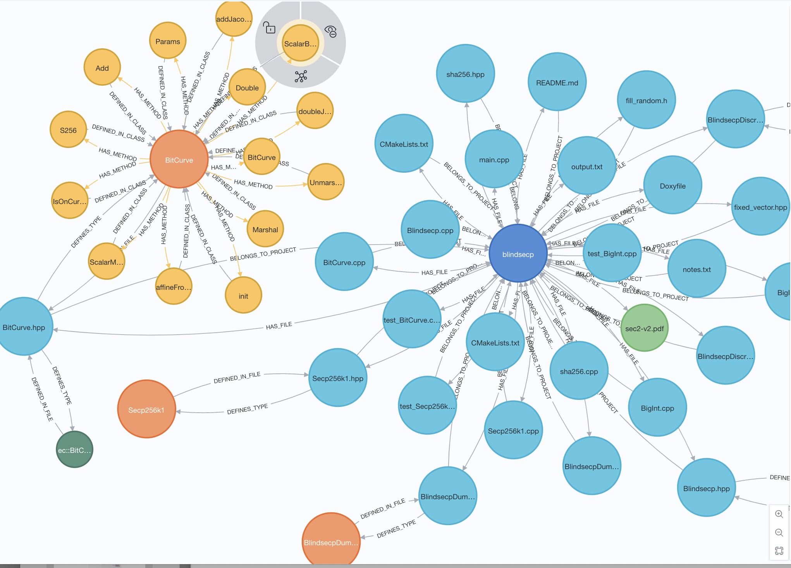
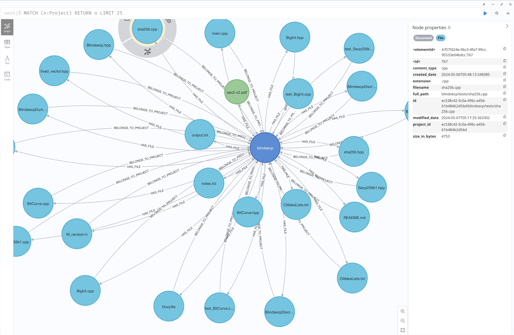
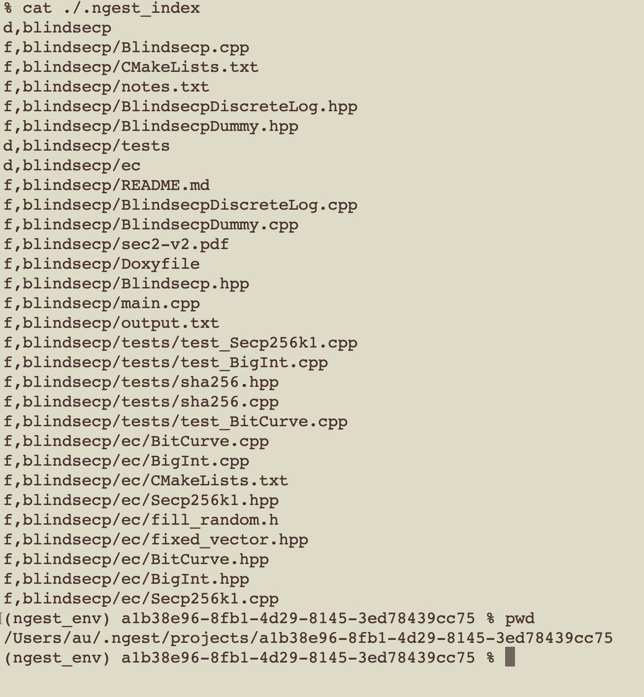
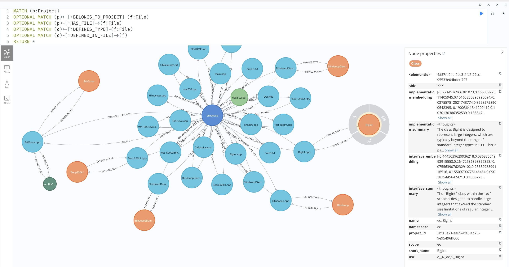
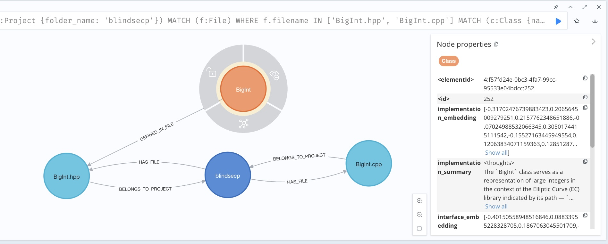
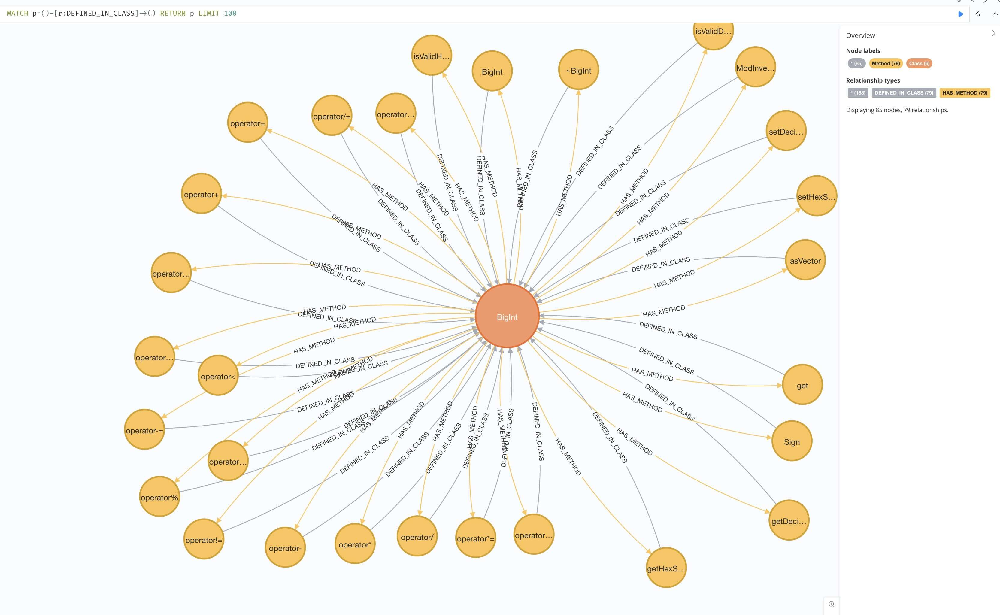
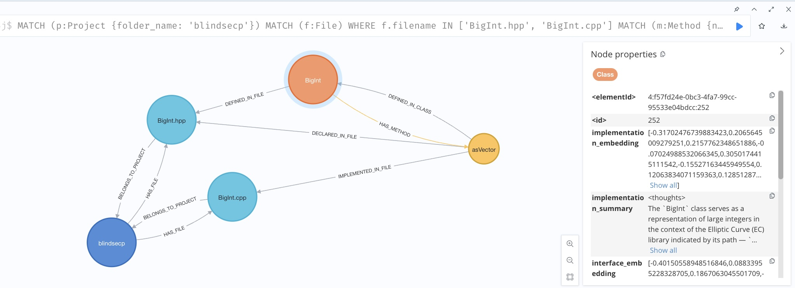
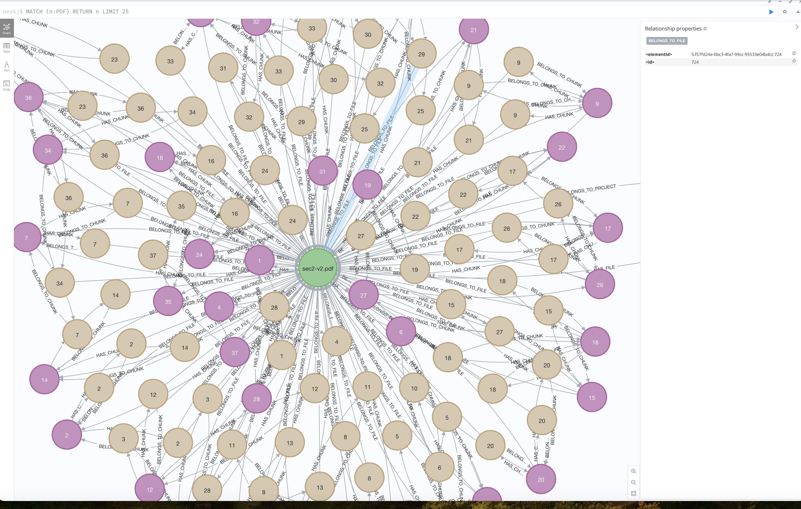

# ngest
Python script for ingesting various files into a semantic graph. For text, images, cpp, python, rust, javascript, and PDFs. Main goal is for meaningful retrieval across large code bases for autocoding with agents. 

### Work in Progress

This project isn't done yet so don't bother using it.
When it's ready there will also be a retrieval script.

Status: we have minimal CPP ingestion now working, as well as 2-layer ingestion for PDFs.

## Details on the Constructed Graph in Neo4J

### A Project contains Files and a Directory Tree

Traverse the Project directory and recursively ingest all the files and folders inside it. 





### Files have ```DEFINES_TYPE``` relationships to Classes



### CPP Classes are correspondingly ```DEFINED_IN_FILE```



### CPP Methods defined in their Class



### CPP Methods are ```DECLARED_IN_FILE``` and ```IMPLEMENTED_IN_FILE```



### PDFs are chunked in 2 levels for Parent Document Retrieval



Rudimentary so far.

## Requirements

This package requires LLVM and its Python bindings to be installed. You can install LLVM using your system's package manager:

- On macOS with Homebrew: `brew install llvm`
- On Ubuntu/Debian: `sudo apt-get install llvm-10 libclang-10-dev`
- On Fedora/RHEL: `sudo dnf install llvm llvm-devel`

After installing LLVM, you may need to set the `LLVM_CONFIG` environment variable to the path of your `llvm-config` binary before installing this package.

### Neo4J

This project uses Neo4J to store the graph and embeddings. 

## Installation

### For Developers

If you're working on ngest or want to use the latest development version, you can install it in editable mode:

1. Clone the repository:
   ```
   git clone https://github.com/fellowtraveler/ngest.git
   cd ngest
   ```

2. Install in editable mode with updated dependencies:
   ```
   pip install -U -e .
   ```

This command should be run from the directory containing `setup.py`. It installs ngest in editable mode and updates all dependencies to their latest compatible versions.

### For Users (Future)

Once ngest is available as a public Python package, you will be able to install it using pip:

```
pip install ngest
```

Note: This method is not yet available as ngest is currently in development.

### Requirements

ngest requires Python 3.7 or later. Some features may require additional system-level dependencies, particularly for working with C++ files. Please refer to the [Clang Setup](#clang-setup) section for more information.

## Clang Setup

This package automatically attempts to set up the Clang library path when it's imported. **No manual setup is required in most cases.**

But if you do need to specify a custom Clang library path, you can do so before using the package:

```python
from ngest.utils.clang_setup import setup_clang

setup_clang(custom_path="/path/to/your/clang/lib")

# Now use the ngest package as normal
import ngest
# ...
```

This manual setup should only be necessary if the automatic setup fails or if you need to use a specific Clang installation.

## Usage

After installing the ngest package, you can use it from the command line as follows:

```
ngest --help
```

### Config file

The first time you run it, it will create a a config file at: ```~/.ngest/config.ini```

- Make sure you edit that config file.
- Set your OpenAI API key for summarizations.
- It currently uses Ollama for embeddings. So you'll need Ollama. More options coming soon.
- By default it uses port 7689 for Neo4J, so you'll probably want to change that to the normal Neo4J port which is 7687. (The reason I use 7689 is because I'm separately running another Neo4J in my R2R setup. Sorry).

### Ingesting a project folder

To ingest a project folder, use the following command:

```
ngest --input_path /path/to/folder create
```

### Using ngest in a Python script

If you want to use ngest in your Python scripts, you can import it as follows:

```python
from ngest import NIngest, ProjectManager

# Your code here
```

Remember that the Clang setup is automatically performed when you import ngest, so no additional setup is required in most cases.

P.S. in case you're curious, this can be used to wipe a Neo4J DB.
Use with caution: ```CALL apoc.schema.assert({},{},true); MATCH (n) DETACH DELETE n;```

## Testing

I put these Cypher queries here mainly for myself.

```
MATCH (p:Project)
OPTIONAL MATCH (p)<-[:BELONGS_TO_PROJECT]-(f:File)
OPTIONAL MATCH (p)-[:HAS_FILE]->(f:File)
OPTIONAL MATCH (c)<-[:DEFINES_TYPE]-(f:File)
OPTIONAL MATCH (c)-[:DEFINED_IN_FILE]->(f)
RETURN *


MATCH (f:File)-[r]-()
WHERE f.full_path ENDS WITH 'ec/BigInt.hpp' OR f.full_path ENDS WITH 'ec/BigInt.cpp'
RETURN f.full_path, TYPE(r) as relationship_type, 
       CASE WHEN STARTNODE(r) = f 
            THEN 'outgoing' 
            ELSE 'incoming' 
       END as direction,
       CASE WHEN STARTNODE(r) = f 
            THEN labels(ENDNODE(r))[0] 
            ELSE labels(STARTNODE(r))[0] 
       END as related_node_type
       
       
       
MATCH (c:Class {short_name: 'BigInt'})-[r]-()
RETURN c.short_name, TYPE(r) as relationship_type, 
       CASE WHEN STARTNODE(r) = c 
            THEN 'outgoing' 
            ELSE 'incoming' 
       END as direction,
       CASE WHEN STARTNODE(r) = c 
            THEN labels(ENDNODE(r))[0] 
            ELSE labels(STARTNODE(r))[0] 
       END as related_node_type
              

MATCH (m:Method)-[r]-()
WHERE m.scope CONTAINS 'BigInt'
RETURN m.short_name, TYPE(r) as relationship_type, 
       CASE WHEN STARTNODE(r) = m 
            THEN 'outgoing' 
            ELSE 'incoming' 
       END as direction,
       CASE WHEN STARTNODE(r) = m 
            THEN labels(ENDNODE(r))[0] 
            ELSE labels(STARTNODE(r))[0] 
       END as related_node_type


Check for Namespace nodes:

MATCH (n:Namespace)
RETURN n.name, n.usr

Verify Class-Method relationships:

MATCH (c:Class)-[:HAS_METHOD]->(m:Method)
RETURN c.name AS ClassName, m.name AS MethodName, m.usr AS MethodUSR

Check for orphaned Methods (Methods not connected to any Class):

MATCH (m:Method)
WHERE NOT (m)<-[:HAS_METHOD]-()
RETURN m.name, m.usr

Verify File relationships:

MATCH (n)-[r]->(f:File)
WHERE type(r) IN ['IMPLEMENTED_IN_FILE', 'DECLARED_IN_FILE']
RETURN labels(n)[0] AS NodeType, n.name AS NodeName, type(r) AS RelationType, f.full_path AS FilePath

Check for nodes without File relationships:

MATCH (n)
WHERE NOT (n)-[:IMPLEMENTED_IN_FILE|DECLARED_IN_FILE]->(:File)
AND n:Class OR n:Method OR n:Function
RETURN labels(n)[0] AS NodeType, n.name AS NodeName, n.usr AS NodeUSR

Verify Namespace-Class relationships:

MATCH (ns:Namespace)-[:CONTAINS]->(c:Class)
RETURN ns.name AS Namespace, c.name AS ClassName
```
